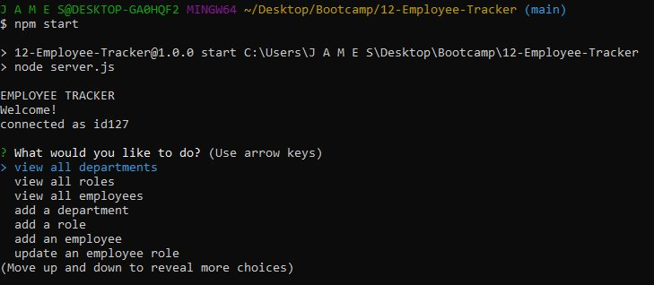
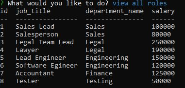
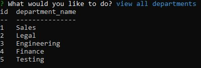
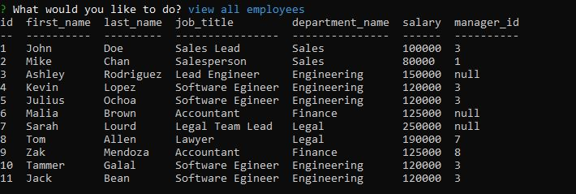

# 12-Employee-Tracker

## Table of Contents
  * [Purpose](#purpose)
  * [Built With](#built-with)
  * [Screenshot](#screenshot)
  * [Links](#links)    

## Purpose
To create a way to track employees using command line. It will keep track of Departments, role/job titles, and employees. It can also add new Departments, role/job titles, and employees. It can also update employee roles.

## Built-With
- Node
- JavaScript 
- MYSQL

## Screenshot
Screenshot of when you start the program  
 
    
Example Screenshot of viewing all departments     
 
   
Example Screenshot of viewing all roles    
  
  
Example Screenshot of viewing all employees  

  

## Links
Links to Video DEMO    
Video DEMO: https://drive.google.com/file/d/1QTv-majpQow8ym8CGKIpVCK-lvdGJVDb/view   
 

